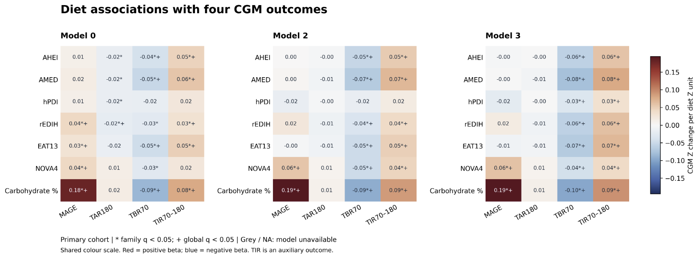
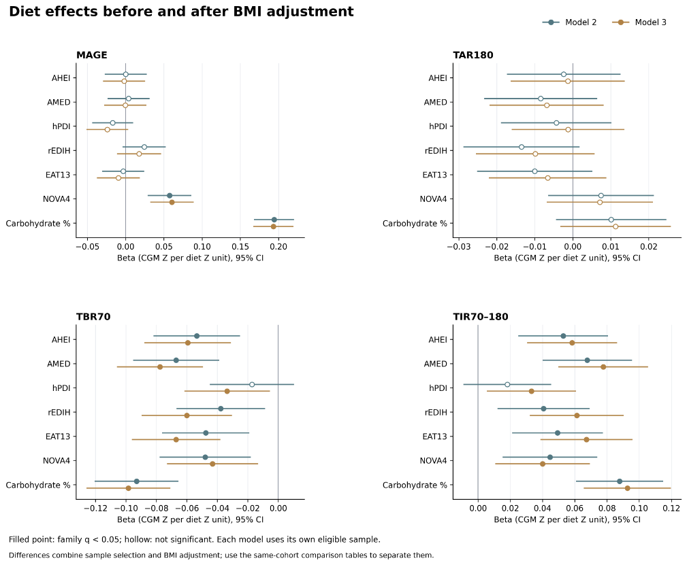
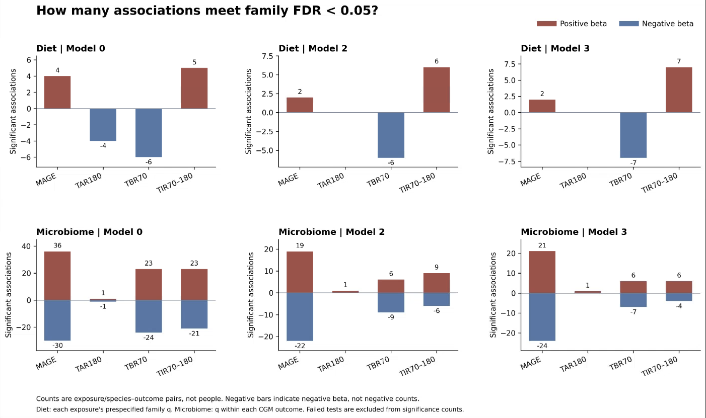
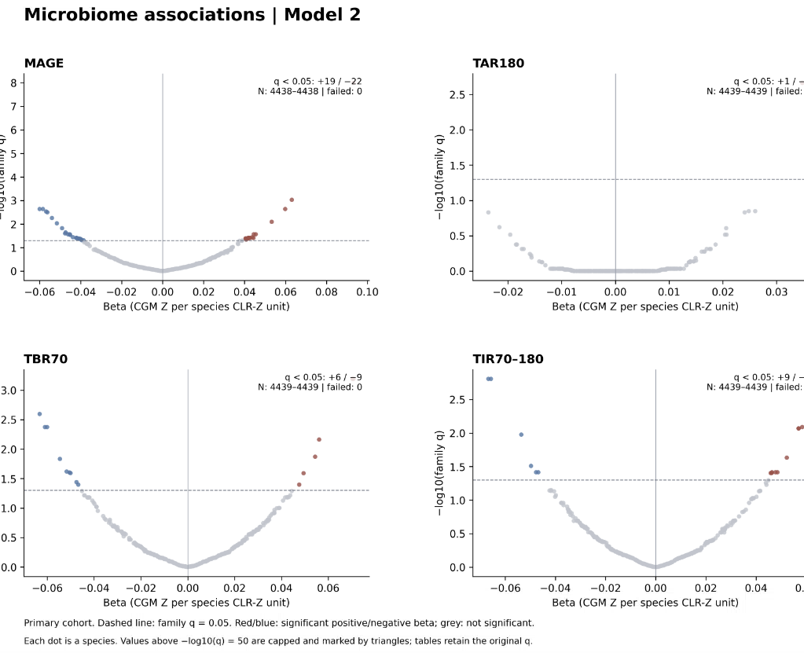
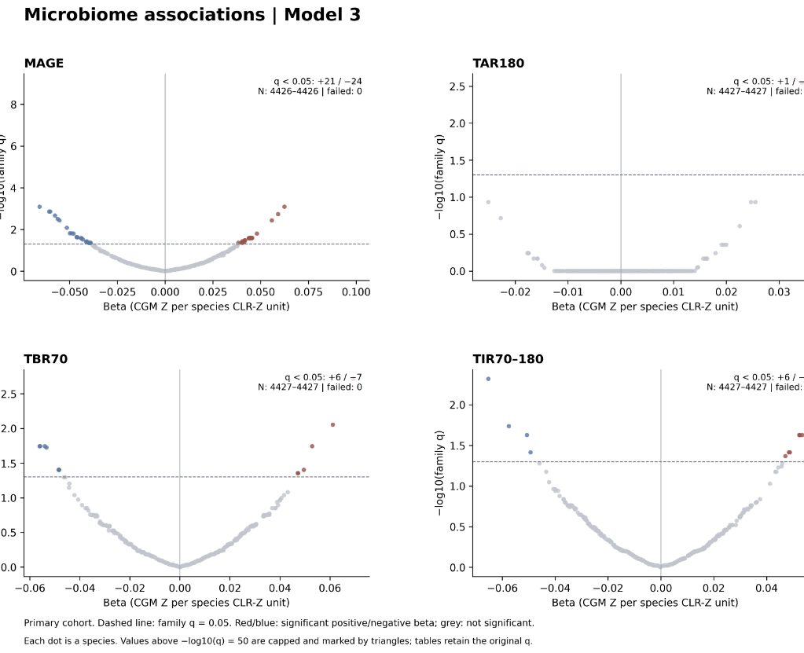
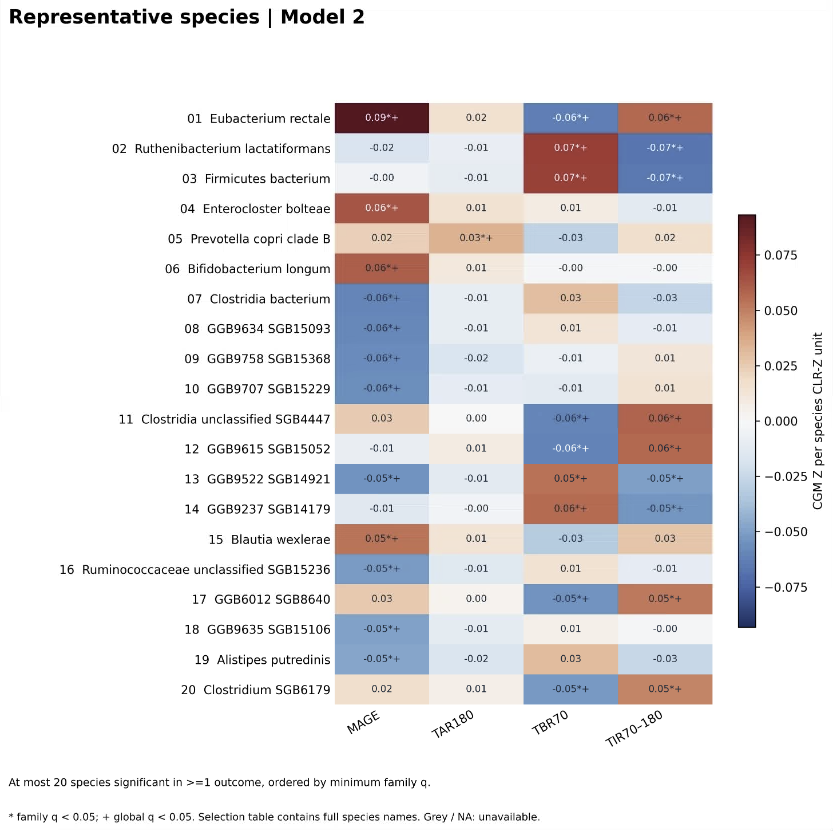
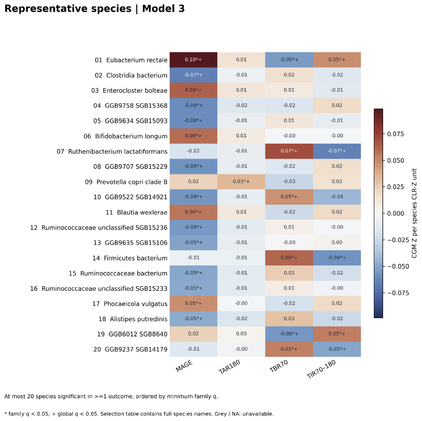

# 新四项 CGM 与饮食、菌群关联分析：阶段报告

**报告日期：2026-09-15**  
**分析版本：4New_cgm，服务器运行入口版本 2026-09-15.2**  
**阶段：独立关联分析、严格人群敏感性分析、同样本模型比较及可视化**  
**正式运行：`run_20260915T105328_605024Z_e6eaf532`**

## 一、摘要：本轮做了什么，得到了什么

本轮在已经完成的 CGM 扩展表基础上，复用既有分析流程，针对 **MAGE、TAR180、TBR70、TIR70–180** 四项血糖结局，分别分析 **7 项饮食暴露**和 **379 个菌群物种**。饮食分支与菌群分支分别建模，并未把七项饮食或所有菌种同时放入一个模型。

本次完成了输入检查、队列合并、主模型、严格人群分析、同样本比较、多重检验校正、数值汇总和七组图。服务器报告分析与绘图均 `completed`，失败检验数为 **0**，运行期间输入源文件未变化。

### 1.1 可以支持的主要结论

1. **NOVA4、碳水供能比与 MAGE 呈显著正关联。** 在主人群 Model 2、额外调整 BMI 的 Model 3，以及严格人群 Model 2/3 中，方向和效应大小接近，均通过家族 FDR＜0.05。这里的“一致”限定于本轮已经检查的人群和调整设置。
2. **饮食与 TAR180 的调整后关联未达到显著。** 七项饮食在主人群 Model 2/3 中均未通过家族或全局 FDR；严格人群对应模型的显著数量也均为 0。
3. **饮食与 TBR70、TIR70–180 的关联较多。** 主人群 Model 2 中，除 hPDI 外的六项饮食均与 TBR70 负关联、与 TIR 正关联；Model 3 中七项均通过家族 FDR。三项时间比例具有互补关系，这些发现不能作为完全独立的重复证据。
4. **hPDI 需要单独说明。** 其与 TBR70、TIR 的关联在 BMI 调整后效应绝对值增大；主人群 Model 3 家族 FDR 约 0.0382，严格人群 Model 3 约 0.0555。效应方向一致，但家族 FDR 显著性随分析设置变化。
5. **菌群发现主要集中于 MAGE。** 主人群 Model 2 中，MAGE、TAR180、TBR70、TIR 分别有 41、1、15、15 个物种通过家族 FDR；Model 3 对应为 45、1、13、10 个。严格人群结果有所变化，尚不能仅凭总数确定每个物种是否稳定。

### 1.2 本报告没有得出的结论

本轮估计的是统计关联，未完成因果效应识别、饮食—菌群—血糖中介分析、逐条 CGM 曲线核查或其他模型的系统验证。不能把某项饮食或某个菌种简单解释为整体“有益/有害”，也不能把一个模型显著、另一个模型不显著直接视为二者效应有显著差异。

## 二、证据来源和版本范围

### 2.1 证据来源

本报告依据以下材料整理：

- 本地 `config/analysis.json`、`scripts/new_cgm_data.py`、`scripts/new_cgm_models.py`、`scripts/run_analysis.py`、`scripts/new_cgm_visuals.py`：核对分析规则和输出定义。
- 用户提供的服务器输入检查、正式运行汇总、饮食 Model 2 全表、菌群各结局前三项、严格人群汇总及重点关联比较截图：核对真实运行数值。
- 用户提供的七张图表截图及其本地裁剪版：核对图形内容。
- 前一阶段 [CGM 四指标扩展处理记录](../../cgm_deal/cgm新增四指标/CGM四指标扩展_处理过程与结果_2026-09-15.md)：说明血糖变量的来源与处理。

**本地没有下载或直接读取服务器完整模型 CSV、日志和 manifest。** 表中数值来自可见终端截图，保留截图显示精度；完整模型结果以服务器 CSV 为准。图中两位小数仅供展示，不能代替完整 β。该报告不是新的拟合运行，也没有通过截图重新计算原模型或 FDR。

可读取的 8 张关键终端截图已保存在 [报告依据截图目录](docs/报告依据截图_2026-09-15)，七张图保存在 [服务器图表截图目录](服务器图表截图)。本地合成测试产物不作为本报告的真实队列证据。

### 2.2 两次运行的区别

| 运行 | ID | 功能及状态 |
|---|---|---|
| 输入检查 | `run_20260915T091514_084902Z_d6bfffbc` | `--check-only`；状态为 `inputs_checked_no_models_fitted`，没有拟合模型 |
| 正式运行 | `run_20260915T105328_605024Z_e6eaf532` | 正式分析、敏感性及图表；状态为 `completed` |
| 本次原始图表批次 | `visual_20260915T105401_103235Z_51aa5b` | 绘图状态 `completed`，本报告七图来自这一批次 |

运行 ID 中的时间是 UTC，不能直接当作截图所示的本地时区时间。

### 2.3 正式完成状态

| 核对项 | 截图结果 | 含义 |
|---|---|---|
| 分析状态 | completed | 脚本报告正式运行完成 |
| 失败检验数 | 0 | 没有记录为无法估计的检验 |
| 源文件未变化 | True | 脚本的运行前后文件指纹检查通过 |
| 分析错误 | 无 | 终端没有报告分析错误 |
| 绘图状态 | completed | 七组图及总览生成成功 |
| 绘图错误 | 无 | 未报告绘图执行异常 |

以上属于运行和数值计算层面的完成证据，不等同于所有统计模型假设已经验证。

## 三、数据基础与人群构建

### 3.1 四项血糖变量如何得到

本轮所谓“新四项”是关联分析中新使用的四项结局，其中 **MAGE 已存在于旧 CGM 表，本轮直接复用**；真正新增提取和标准化的是三个时间比例。

| 结局 | 字段 | 含义 | 数据准备方式 |
|---|---|---|---|
| MAGE | `cgm_mage_z` | 平均血糖波动幅度 | 复用旧 raw、clean、Z |
| TAR180 | `cgm_above_180_z` | 源表定义的高于 180 mg/dL 的时间百分比 | 提取合法比例后独立标准化 |
| TBR70 | `cgm_below_70_z` | 源表定义的低于 70 mg/dL 的时间百分比 | 同上 |
| TIR70–180 | `cgm_in_range_70_180_z` | 源表定义的 70–180 mg/dL 范围内时间百分比 | 同上；本轮作为辅助结局 |

具体阈值边界的计算沿用 iglu 源表，本轮没有重新从逐条读数计算时间比例。旧队列及 baseline connection 固定；CGM 扩展时按完整连接键匹配，后续跨饮食、菌群和协变量表时按参与者一对一合并。

CGM 扩展的关键规则：

- 三项比例按 **0–100 百分比**处理；0 和 100 均为合法值。
- 本次三项无源缺失和范围外非法值，`clean = raw`，不截尾、不对数变换、不填补零值。
- 每项新比例在原固定 CGM 队列中独立计算 Z，样本 SD 使用 `ddof=1`。
- MAGE clean/Z 的原有缺失保留。
- 后续饮食或菌群子集不重新计算 CGM Z；不以“四项同时完整”作为统一入组条件。

| 结局 | 原值有效 N | clean/Z 有效 N | clean 中 0 值人数 | 原固定队列的 Z 检查 |
|---|---:|---:|---:|---|
| MAGE | 7,493 | 7,478 | 0 | 均值约 0、样本 SD 约 1 |
| TAR180 | 7,493 | 7,493 | 5,638 | 同上 |
| TBR70 | 7,493 | 7,493 | 1,143 | 同上 |
| TIR70–180 | 7,493 | 7,493 | 0 | 同上 |

TAR180 的零值比例约 **75.24%**。三项比例原始均值分别约为 **0.3355%、5.4887%、94.1758%**。这解释了为何需要关注零值集中和比例边界；Z 标准化不会消除这些分布特征。

### 3.2 五份输入

下面路径以服务器 `/home/ec2-user/Desktop/HPP/Data/` 为根。

| 输入 | 行数/规模 | 相对路径 |
|---|---:|---|
| 扩展后的 CGM 表 | 7,493 行 | `cgm_deal/outputs/cgm_extension/data/finalize_20260915T074925_139680Z_b375d22f/06_cgm_extended_phenotypes.csv` |
| 原四项饮食评分 | 9,737 行 | `diet_microbiome_analysis/data/00_current_four_scores_all_participants.csv` |
| 新增三项饮食候选表 | 9,737 行 | `diet_microbiome_glucose_analysis/outputs/reports/new_diet_extension/15b_new_diet_extension_candidate_master.csv` |
| 菌群 CLR-Z 表 | 9,074 行，379 个物种 | `gut_microbiome_deal/data/08_species_clr_zscore.csv` |
| 协变量主表 | 12,014 行 | `co-variant/outputs/data/02_covariate_master.csv` |

新增饮食候选表是暴露数据来源，不是旧关联结果。分析没有根据旧显著性选择本次饮食、结局或物种。

### 3.3 队列合并与排除

ID 按文本规范化，保留前导零，去两侧空白及旧流程规定的尾随 `.0`；合并前检查缺失与重复。原四评分和新增饮食表先外连接，再形成与 CGM 的可用交集，不强制七项饮食同时完整。菌群分支独立使用菌群与 CGM 的交集，不要求具有饮食数据。

| 阶段 | 饮食分支 | 菌群分支 |
|---|---:|---:|
| 与 CGM 匹配的人数 | 6,706 | 6,530 |
| 明确糖尿病或降糖药使用、被排除人数 | 142 | 102 |
| 主人群人数 | 6,564 | 6,428 |
| 排除状态未知人数，主人群保留 | 617 | 891 |
| 严格人群人数 | 5,947 | 5,537 |
| 缺少整条协变量记录的人数 | 0 | 0 |

定义为：主人群仅排除 `exclude_diabetes_or_a10 == 1`；严格人群仅保留该字段 `== 0`。这里的“严格”是依据已记录标志排除未知状态，不代表通过本轮检查排除了所有未诊断疾病。

算术关系核对：饮食 `6706 − 142 = 6564`，`6564 − 617 = 5947`；菌群 `6530 − 102 = 6428`，`6428 − 891 = 5537`。

### 3.4 为什么实际模型 N 进一步减少

合并成功不等于每个字段完整。每个模型进一步要求自身暴露、结局及所需协变量完整；不采用统一的七饮食×四结局完整样本。

以下缺失人数的分母分别为合并后 **6,706 人、6,530 人**，尚未按主人群或严格人群筛选，不能直接用它们相加推算最终模型 N。

| 字段 | 饮食分支缺失 | 菌群分支缺失 |
|---|---:|---:|
| MAGE Z | 13 | 5 |
| 三项时间比例 Z | 均为 0 | 均为 0 |
| 睡眠 | 1,303 | 1,200 |
| 体力活动 | 1,590 | 1,489 |
| 教育 | 1,310 | 1,209 |
| 吸烟 | 1,325 | 1,222 |
| 维生素使用 | 234 | 485 |
| 激素使用 | 234 | 485 |
| BMI | 15 | 14 |

饮食分支原四评分均无缺失；EAT13、NOVA4、碳水供能比分别缺失 **159、758、34** 人。总能量和饮酒字段在该合并表中无缺失。协变量完整标志“字段没有缺失”只表示标志值被填写，并不意味着标志全部为 True。

## 四、模型、检验和比较规则

### 4.1 七项饮食暴露

| 显示名称 | 输入字段 | 模型中的暴露列 | 校正家族 |
|---|---|---|---|
| AHEI | `AHEI_z` | 同名 | 原四评分 |
| AMED | `AMED_z` | 同名 | 原四评分 |
| hPDI | `hPDI_z` | 同名 | 原四评分 |
| rEDIH | `rEDIH_z` | 同名 | 原四评分 |
| EAT13 | `modified_eat_lancet13_z` | `EAT13_z` | 新增主要暴露 |
| NOVA4 | `nova4_total_energy_pct_cov80_z` | `NOVA4_z` | 新增主要暴露 |
| 碳水供能比 | `carbohydrate_energy_pct_z` | `Carbohydrate_pct_z` | 探索暴露 |

所有暴露使用输入表中的 Z。NOVA4 沿用原候选表的总能量分母和至少 80% 映射覆盖率定义，本轮没有重新评分。

### 4.2 模型定义

复用原数值函数进行普通最小二乘回归（OLS），沿用常规标准误、t 检验和 95% 置信区间。每次拟合一个饮食暴露或一个物种与一个 CGM 结局。

| 模型 | 基本调整项 | 用途 |
|---|---|---|
| Model 0 | 无协变量 | 未调整关联参照 |
| Model 2 | 年龄、性别、教育、吸烟、睡眠、体力活动、维生素使用、激素使用、CGM 设备 | 主要调整模型 |
| Model 3 | Model 2 + BMI | 额外 BMI 调整比较 |

暴露专属规则：

- hPDI 的 Model 2/3 额外加入饮酒。
- EAT13、NOVA4、碳水供能比的 Model 2/3 额外加入总能量。
- 菌群模型不添加上述饮食专属饮酒或能量项。
- 连续协变量沿旧代码在所选模型样本中按 `ddof=0` 编码；这与 CGM 的全队列 `ddof=1` Z 定义不同。
- 饮食使用原协变量完整标志并检查实际字段；菌群使用实际字段完整性。
- 最小拟合人数设置为 100；本次没有因此失败的检验。

β 的含义：饮食输入 Z 增加 1 单位对应 CGM Z 的变化；菌群输入 CLR-Z 增加 1 单位对应 CGM Z 的变化。它不是原始百分比变化、原始血糖值变化或绝对风险变化。由于 Z 在上游定义，这里也不应改写成“在当前模型样本中恰好增加 1 个 SD”。

### 4.3 实际运行的七组设置

| analysis_set | 拟合模型 | 人群/样本说明 |
|---|---|---|
| primary | 0、2、3 | 主人群，每个模型使用自身完整样本 |
| strict | 2、3 | 排除状态明确为 0 的人群 |
| same_m2 | 0 | 在主人群 Model 2 的同一批参与者上拟合 Model 0 |
| same_m3 | 2 | 在主人群 Model 3 的同一批参与者上拟合 Model 2 |

对应计划检验行数为饮食 `7×4×7 = 196`，菌群 `379×4×7 = 10,612`。这是配置和循环对应的计划规模；未在本地读取完整 CSV 再逐行计数。服务器总失败检验数为 0。

### 4.4 FDR 校正及判定口径

每个分析人群和模型分别使用 Benjamini–Hochberg（BH）方法，家族及全局范围如下：

| 分支 | 家族 FDR | 全局 FDR |
|---|---|---|
| 原四评分 | 4 项饮食×4 结局＝16 次 | 同次模型全部 7×4＝28 次 |
| EAT13、NOVA4 | 2×4＝8 次 | 同上 |
| 碳水供能比 | 1×4＝4 次 | 同上 |
| 菌群 | 每个结局 379 次 | 四结局共 1,516 次 |

正文“显著”未另说明时指 **家族 FDR＜0.05**，全局 FDR 单独列示。不同模型、人群之间不合并为同一个校正家族，因此不能在多个版本中只挑最显著的一个作为唯一结论。

**全局 FDR 不保证逐项大于家族 FDR。** 更换 BH 检验集合会改变排序和调整结果，不能把全局口径简单当作每项均更严格的嵌套筛选。比如主人群菌群 TAR180 的家族显著数为 1、全局显著数为 4；这是不同口径，不应混用。

失败检验按代码保留计划规模：内部以 p=1 占位，实际输出 p/q 留空。本次失败为 0，未涉及失败导致的有效行减少。

## 五、主人群饮食结果

### 5.1 显著数量及模型样本量

每个格子的显著数量以“家族 / 全局”列示，各结局均计划 7 个饮食检验。

| 结局 | Model 2 N 范围 | Model 2 显著数 | Model 3 N 范围 | Model 3 显著数 |
|---|---:|---:|---:|---:|
| MAGE | 4,174–4,676 | 2 / 2 | 4,162–4,664 | 2 / 2 |
| TAR180 | 4,176–4,678 | 0 / 0 | 4,164–4,666 | 0 / 0 |
| TBR70 | 4,176–4,678 | 6 / 6 | 4,164–4,666 | 7 / 7 |
| TIR70–180 | 4,176–4,678 | 6 / 6 | 4,164–4,666 | 7 / 7 |

所有已列检验均成功。MAGE 的 N 比同暴露其他结局略少，符合其上游存在 clean/Z 缺失的情况。

### 5.2 主人群 Model 2 全部 28 项结果

以下转录自终端截图 S06。q 表示家族 FDR；数值保持截图精度。完整 p、全局 FDR 及更多小数位应查服务器完整表。

| 饮食 | 结局 | N | β | 95% CI | 家族 q | q＜0.05 |
|---|---|---:|---:|---|---:|---|
| AHEI | MAGE | 4676 | 0.0002078 | −0.02732～0.02774 | 0.9882 | 否 |
| AHEI | TAR180 | 4678 | −0.002384 | −0.01732～0.01256 | 0.8307 | 否 |
| AHEI | TBR70 | 4678 | −0.05348 | −0.08189～−0.02508 | 0.0009024 | 是 |
| AHEI | TIR70–180 | 4678 | 0.05282 | 0.0249～0.08073 | 0.0009024 | 是 |
| AMED | MAGE | 4676 | 0.003926 | −0.02347～0.03133 | 0.8307 | 否 |
| AMED | TAR180 | 4678 | −0.008458 | −0.02333～0.00641 | 0.3531 | 否 |
| AMED | TBR70 | 4678 | −0.06702 | −0.09527～−0.03878 | 2.707e−05 | 是 |
| AMED | TIR70–180 | 4678 | 0.06774 | 0.03999～0.0955 | 2.707e−05 | 是 |
| hPDI | MAGE | 4676 | −0.01702 | −0.04383～0.009796 | 0.322 | 否 |
| hPDI | TAR180 | 4678 | −0.004331 | −0.01889～0.01023 | 0.6899 | 否 |
| hPDI | TBR70 | 4678 | −0.01729 | −0.04501～0.01042 | 0.322 | 否 |
| hPDI | TIR70–180 | 4678 | 0.01809 | −0.009146～0.04532 | 0.322 | 否 |
| rEDIH | MAGE | 4676 | 0.02427 | −0.003937～0.05248 | 0.1834 | 否 |
| rEDIH | TAR180 | 4678 | −0.01351 | −0.02881～0.001785 | 0.1834 | 否 |
| rEDIH | TBR70 | 4678 | −0.03774 | −0.06685～−0.008626 | 0.02953 | 是 |
| rEDIH | TIR70–180 | 4678 | 0.04064 | 0.01203～0.06924 | 0.01719 | 是 |
| EAT13 | MAGE | 4581 | −0.003177 | −0.03082～0.02446 | 0.8217 | 否 |
| EAT13 | TAR180 | 4583 | −0.01001 | −0.02518～0.005152 | 0.2607 | 否 |
| EAT13 | TBR70 | 4583 | −0.04764 | −0.07628～−0.01901 | 0.002976 | 是 |
| EAT13 | TIR70–180 | 4583 | 0.0493 | 0.02115～0.07744 | 0.002398 | 是 |
| NOVA4 | MAGE | 4174 | 0.05742 | 0.029～0.08583 | 0.0006062 | 是 |
| NOVA4 | TAR180 | 4176 | 0.007417 | −0.006514～0.02135 | 0.339 | 否 |
| NOVA4 | TBR70 | 4176 | −0.04799 | −0.07791～−0.01807 | 0.003355 | 是 |
| NOVA4 | TIR70–180 | 4176 | 0.04467 | 0.01531～0.07403 | 0.004599 | 是 |
| 碳水供能比 | MAGE | 4653 | 0.1942 | 0.168～0.2204 | 2.258e−46 | 是 |
| 碳水供能比 | TAR180 | 4655 | 0.0101 | −0.004443～0.02465 | 0.1734 | 否 |
| 碳水供能比 | TBR70 | 4655 | −0.09301 | −0.1206～−0.06544 | 8.291e−11 | 是 |
| 碳水供能比 | TIR70–180 | 4655 | 0.08779 | 0.06069～0.1149 | 3.119e−10 | 是 |

### 5.3 如何概括饮食结果

**MAGE：** NOVA4 和碳水供能比是主人群 Model 2 的两项显著暴露；全局 FDR 分别约为 0.0003536、1.581e−45，也通过 0.05。碳水供能比在这组模型中的标准化 β 较大，但不能据此宣称它的因果作用最强，或已对所有暴露完成正式效应差异检验。

**TAR180：** 未调整图中存在部分显著负关联，主人群 Model 2/3 均不显著。未调整与调整模型的人群也不同，尚未展示这部分同样本系数明细，因此不把全部变化简单归因为协变量混杂消除。

**TBR70 与 TIR：** Model 2 中显著的六项为 AHEI、AMED、rEDIH、EAT13、NOVA4、碳水供能比，方向分别为负、正。TAR、TBR、TIR 的原始百分比合计约为 100，三项的统计结果存在结构联系，标准化也没有让它们变成独立指标。

## 六、严格人群和同样本比较

### 6.1 严格人群：完整汇总

每格显著数仍为“家族 / 全局”。所有表内失败数均为 0。

| 分支 | 结局 | Model 2 N 范围 | Model 2 显著数 | Model 3 N 范围 | Model 3 显著数 |
|---|---|---:|---:|---:|---:|
| 饮食 | MAGE | 3901–4381 | 2 / 2 | 3889–4369 | 2 / 2 |
| 饮食 | TAR180 | 3903–4383 | 0 / 0 | 3891–4371 | 0 / 0 |
| 饮食 | TBR70 | 3903–4383 | 6 / 6 | 3891–4371 | 6 / 7 |
| 饮食 | TIR70–180 | 3903–4383 | 6 / 6 | 3891–4371 | 6 / 7 |
| 菌群 | MAGE | 4139 | 25 / 15 | 4127 | 37 / 21 |
| 菌群 | TAR180 | 4140 | 1 / 3 | 4128 | 1 / 4 |
| 菌群 | TBR70 | 4140 | 21 / 12 | 4128 | 12 / 12 |
| 菌群 | TIR70–180 | 4140 | 17 / 8 | 4128 | 4 / 10 |

严格人群饮食 Model 3 的 TBR、TIR 全局口径均为 7 项，说明七项均通过全局阈值；家族口径为 6 项。结合下表，hPDI 属于**家族未过阈值、全局已过阈值**的情况。应保留两个口径，不为获得显著结果临时更换正文判定标准。

### 6.2 四组重点关联的全部已展示数值

`same_m3 / Model 2` 是在主人群 Model 3 的同一批人中拟合 Model 2，没有加入 BMI。其作用是把样本筛选的变化和额外 BMI 调整的变化分开。

| 关联 | 人群/设置 | 模型 | N | β | 家族 FDR |
|---|---|---:|---:|---:|---:|
| 碳水供能比 → MAGE | primary | 2 | 4653 | 0.1942 | 2.258e−46 |
| 碳水供能比 → MAGE | same_m3 | 2 | 4641 | 0.1949 | 1.383e−46 |
| 碳水供能比 → MAGE | primary | 3 | 4641 | 0.1932 | 9.141e−46 |
| 碳水供能比 → MAGE | strict | 2 | 4358 | 0.1954 | 1.375e−43 |
| 碳水供能比 → MAGE | strict | 3 | 4346 | 0.1943 | 5.644e−43 |
| NOVA4 → MAGE | primary | 2 | 4174 | 0.05742 | 0.0006062 |
| NOVA4 → MAGE | same_m3 | 2 | 4162 | 0.05776 | 0.0005586 |
| NOVA4 → MAGE | primary | 3 | 4162 | 0.06056 | 8.141e−05 |
| NOVA4 → MAGE | strict | 2 | 3901 | 0.05551 | 0.001748 |
| NOVA4 → MAGE | strict | 3 | 3889 | 0.05924 | 0.0002169 |
| hPDI → TBR70 | primary | 2 | 4678 | −0.01729 | 0.322 |
| hPDI → TBR70 | same_m3 | 2 | 4666 | −0.01708 | 0.3337 |
| hPDI → TBR70 | primary | 3 | 4666 | −0.03357 | 0.03818 |
| hPDI → TBR70 | strict | 2 | 4383 | −0.01628 | 0.36 |
| hPDI → TBR70 | strict | 3 | 4371 | −0.03276 | 0.05549 |
| hPDI → TIR70–180 | primary | 2 | 4678 | 0.01809 | 0.322 |
| hPDI → TIR70–180 | same_m3 | 2 | 4666 | 0.01782 | 0.3337 |
| hPDI → TIR70–180 | primary | 3 | 4666 | 0.03308 | 0.03818 |
| hPDI → TIR70–180 | strict | 2 | 4383 | 0.01728 | 0.36 |
| hPDI → TIR70–180 | strict | 3 | 4371 | 0.03236 | 0.05549 |

### 6.3 如何解释这些比较

**碳水供能比 → MAGE：** 在相同 4,641 人中，未加 BMI 的 β 为 0.1949，加入 BMI 后为 0.1932；严格人群也约为 0.194–0.195。这一正关联对已检验设置较一致。

**NOVA4 → MAGE：** 相同 4,162 人中，β 由 0.05776 变为 0.06056，方向保持；严格人群 β 为 0.05551、0.05924，均通过家族 FDR。

**hPDI → TBR/TIR：** 从原 Model 2 换成同样本 Model 2 时，β 变化很小；在同一批人中加入 BMI 后，效应绝对值增大。它支持“该次系数变化主要出现在 BMI 调整步骤”，但不能据此判定 BMI 的因果角色或认定某种生物学机制。严格人群 Model 3 的 β 接近主人群，却在家族 FDR 的 0.05 附近跨过阈值；不应把这种情况写成关联方向相反或完全消失。

### 6.4 参与者集合核对

| 分支 | 比较 | 同样本低阶模型与高阶模型的参与者集合完全一致 |
|---|---|---|
| 饮食 | M0 → M2 | True |
| 饮食 | M2 → M3 | True |
| 菌群 | M0 → M2 | True |
| 菌群 | M2 → M3 | True |

该检查使用参与者集合 SHA256，而不只比较 N。它不表示原主人群 Model 0、2、3 天然拥有相同样本，也不代表所有比较的系数明细已经在本报告逐项审核。

## 七、菌群结果

### 7.1 主人群数量、方向及模型 N

正/负数量均按家族 FDR。不同结局中的同一物种可以重复出现，不能相加后当作独立菌种数。

| 结局 | M2 N | M2 正 / 负 | M2 家族 / 全局 | M3 N | M3 正 / 负 | M3 家族 / 全局 |
|---|---:|---:|---:|---:|---:|---:|
| MAGE | 4438 | 19 / 22 | 41 / 18 | 4426 | 21 / 24 | 45 / 23 |
| TAR180 | 4439 | 1 / 0 | 1 / 4 | 4427 | 1 / 0 | 1 / 4 |
| TBR70 | 4439 | 6 / 9 | 15 / 15 | 4427 | 6 / 7 | 13 / 13 |
| TIR70–180 | 4439 | 9 / 6 | 15 / 15 | 4427 | 6 / 4 | 10 / 12 |

MAGE 是家族 FDR 显著关联最多的结局；TAR180 最少。这只描述本轮检测结果，不足以说明某个结局与菌群的生物学联系必然更强。

### 7.2 终端显示的代表结果

以下选自 S07 可直接核实的 Model 2 数值。为便于阅读，物种使用末级名称；正式追踪仍应保留服务器表中的完整分类字符串和 SGB 编号。

| 物种 | 结局 | β | 家族 FDR | 全局 FDR |
|---|---|---:|---:|---:|
| Eubacterium rectale | MAGE | 0.09316 | 1.012e−08 | 4.048e−08 |
| Enterocloster bolteae | MAGE | 0.06307 | 0.0009397 | 0.001733 |
| Bifidobacterium longum | MAGE | 0.05986 | 0.002312 | 0.003782 |
| Prevotella copri clade B | TAR180 | 0.03477 | 0.002166 | 0.001733 |
| Ruthenibacterium lactatiformans | TBR70 | 0.07077 | 0.0006439 | 0.001717 |
| Eubacterium rectale | TBR70 | −0.06324 | 0.002537 | 0.003782 |
| Ruthenibacterium lactatiformans | TIR70–180 | −0.06668 | 0.001551 | 0.001773 |

热图进一步显示，Eubacterium rectale 在主人群 Model 2/3 中均与 MAGE 正关联、TBR 负关联、TIR 正关联；Prevotella copri clade B 在两个模型中均与 TAR180 显著正关联。热图数值只有两位小数，此处不补写未经完整表核实的精确 Model 3 数值。

**不要依据菌名预设方向。** 例如某物种与 MAGE 为正、TBR 为负、TIR 为正，这些描述针对不同血糖维度，不能简单归并成“该菌改善所有血糖指标”。本报告不补充未经本轮数据检验的功能或机制解释。

### 7.3 严格人群中的变化及尚未确认的事项

严格人群的家族显著数量已经列于第六节。例如菌群 Model 2 的 MAGE 从 41 变为 25，TBR 从 15 变为 21；Model 3 的 TIR 从 10 变为 4。人数减少并不保证显著数必然减少；系数、标准误和 BH 排序均可能变化。

当前没有展示每个物种的 primary/strict 完整合并明细，因此尚未确认：

- 哪些具体物种在所有设置中均显著、方向一致；
- 哪些只是 FDR 在 0.05 附近变化；
- 是否存在效应方向改变或明显幅度变化；
- 同样本条件下菌群系数受 BMI 调整的逐项影响。

不能把“严格人群 TAR180 仍有 1 个”直接替换成“严格人群同一个菌已证实稳定”。

## 八、七张图逐张说明

### 8.1 图 1：饮食关联热图

**文件：`01_diet_heatmap.png`**



**作用：** 一次查看全部 7×4 组合的方向、大小和显著性，并比较主人群 Model 0、2、3 的整体模式。

**读图：** 行是饮食，列是血糖结局；红色为正 β，蓝色为负 β，三个面板共用色标。数字是保留两位小数的 β；`*` 表示家族 FDR＜0.05，`+` 表示全局 FDR＜0.05。`0.00` 或 `−0.00` 可能只是舍入，不代表精确零。

**本图结论：** NOVA4、碳水供能比与 MAGE 的正关联在三个主模型中可见；TAR180 在调整后没有显著饮食关联；TBR 的负关联和 TIR 的正关联较集中。hPDI 在 Model 3 的 TBR、TIR 中新增显著标记。

**边界：** 本图只含主人群，不显示 strict 或同样本模型；模型之间可能有不同样本。不能只根据颜色变化归因于某个协变量，也不能仅凭颜色判定健康意义。

### 8.2 图 2：饮食效应及置信区间森林图

**文件：`02_diet_forest.png`**



**作用：** 查看效应大小及不确定性，比较额外 BMI 调整前后的系数，而不仅看是否有星号。

**读图：** 四个面板分别对应四个 CGM；点为 β，横线为常规 95% CI。青色为 Model 2，橙色为 Model 3；实心点为家族 FDR 显著，空心点为未过家族阈值。置信区间是原模型区间，没有作多重检验校正；因此“CI 不跨零”与“家族 FDR 显著”不必完全一致。

**本图结论：** NOVA4、碳水供能比的 MAGE 系数在两模型间接近；TAR180 的各饮食区间跨过零；hPDI 的 TBR、TIR 系数在 Model 3 中离零更远。其具体变化已由第六节同样本数值补充说明。

**边界：** 各面板横轴范围不同，不能比较横线的屏幕长度来判断不同结局的效应或精度；两条 CI 是否重叠也不是正式模型效应差异检验。

### 8.3 图 3：显著关联数量图

**文件：`03_significant_counts.png`**



**作用：** 概览不同结局、不同模型中显著关联的数量及方向。

**读图：** 上排是饮食，下排是菌群；三列为 Model 0、2、3。红柱向上表示正关联数量，蓝柱向下表示负关联数量。蓝柱标记 `−22` 意味着“22 个负关联”，不是负的检验数。全图采用家族 FDR。

**本图结论：** 饮食 Model 2 的 MAGE、TAR、TBR、TIR 分别为 2、0、6、6 个显著组合；Model 3 为 2、0、7、7。菌群 Model 2 对应为 41、1、15、15，Model 3 为 45、1、13、10，且 MAGE 同时包含较多正、负关联。

**边界：** 这些是“暴露/物种×结局”的组合数，不是人数或不重复物种数；数量增减不表示整体效应一定增大或减小，也不表示同一组物种始终显著。本图不展示全局 FDR 或严格人群。

### 8.4 图 4：菌群 Model 2 火山图

**文件：`04_microbiome_volcano_M2.png`**



**作用：** 在全部 379 个物种范围内，查看效应方向、效应大小及统计证据分布，避免只看到已筛选的代表菌。

**读图：** 横轴为 β；纵轴为 `−log10(家族 FDR)`，越高表示 q 越小。虚线对应 q=0.05；红/蓝点为显著正/负关联，灰点为未过家族阈值。每个点对应一个物种。

**本图结论：** MAGE 为 19 个正关联、22 个负关联；TAR180 为 1 个正关联；TBR70 为 6 个正、9 个负；TIR 为 9 个正、6 个负。MAGE 的最小家族 FDR 约为 1.01e−08，与终端中的 Eubacterium rectale 对应。

**显示问题：** 本报告保留的是原服务器图截图。右上角说明框位于绘图区内，会遮住右上角的部分点，尤其是 MAGE 最显著点和 TAR180 唯一显著点附近；不能据肉眼未见该点认为其不存在。计数和数值应以终端表为准。本地脚本已将说明移到绘图区外并用合成极端点验证，但用户尚未提供服务器重绘版，此处没有用重绘或生成内容替换原截图。

**边界：** 图中近似弧形的排列不是程序报错的证据，也不是新的生物学发现；在样本量和暴露尺度接近时，系数大小与检验统计量本就可能紧密相关。本轮没有据形状诊断所有模型假设。

### 8.5 图 5：菌群 Model 3 火山图

**文件：`05_microbiome_volcano_M3.png`**



**作用：** 查看额外 BMI 调整后所有物种的关联分布，与图 4 对照。

**读图：** 坐标和颜色规则同图 4；这张图使用主人群 Model 3，MAGE N=4,426，其他结局 N=4,427。

**本图结论：** MAGE 为 21 个正、24 个负关联；TAR180 为 1 个正关联；TBR 为 6 个正、7 个负；TIR 为 6 个正、4 个负。相较 Model 2，MAGE 显著总数增多，TBR、TIR 减少。

**边界：** 不能把这种数量变化直接解释为 BMI 产生了或消除了某条生物学通路；还需要同样本系数表。各图/各面板坐标尺度可能不同，不宜直接比较点在页面上的高度。原截图同样存在右上角说明遮挡问题。

### 8.6 图 6：菌群 Model 2 代表物种热图

**文件：`06_microbiome_heatmap_M2.png`**



**作用：** 将代表物种在四种血糖结局中的模式并排显示，帮助识别一个物种对应多个结局的情况。

**筛选规则：** 先选择至少一个结局通过家族 FDR 的物种，按四结局中的最小家族 q 排序，最多显示 20 个。不是每个结局各取 20 个，也不是所有显著物种的完整清单。其余结局即使不显著，也保留在该物种同一行中。

**本图结论：** Eubacterium rectale 对应 MAGE 正、TBR 负、TIR 正的显著模式；Ruthenibacterium lactatiformans、图示 Firmicutes bacterium 对应 TBR 正、TIR 负；Prevotella copri clade B 的主要显著格子是 TAR180。Enterocloster bolteae、Bifidobacterium longum 在 MAGE 上为显著正关联。

**边界：** 某物种排在前面，只说明它在当前筛选规则下具有较小的最小 q，不代表生物学重要性排序。末级名称可能较宽泛或经过截短，应以服务器 `selection.csv` 中完整名称为准。严格人群未显示于本图。

### 8.7 图 7：菌群 Model 3 代表物种热图

**文件：`07_microbiome_heatmap_M3.png`**



**作用：** 查看额外 BMI 调整后代表物种的四结局模式，与图 6 形成对照。

**筛选规则：** 在 Model 3 内重新按相同规则独立选前 20 个，因此与图 6 的行次序和物种集合不完全相同。

**本图结论：** Eubacterium rectale 的 MAGE 正、TBR 负、TIR 正模式仍然可见；Prevotella copri clade B 的 TAR180 正关联仍通过阈值；Enterocloster bolteae、Bifidobacterium longum 的 MAGE 正关联仍可见。部分其他物种的排名或入选状态改变。

**边界：** 要按完整菌名对照，不能逐行把第 2 行与第 2 行视为同一菌；某菌没有出现在前 20 并不意味着模型中没有该菌或它已不显著。两张菌群热图各自按所选数值设置色标，精确比较应使用 β 和表格。它们也不证明严格人群中的同一菌已经稳定。

## 九、综合解释与报告用结论

### 9.1 建议采用的结果叙述

> 在既有 CGM 固定队列基础上，本研究阶段分析了七项饮食暴露及 379 个菌群物种与 MAGE、TAR180、TBR70 和 TIR70–180 的关联。主人群主要调整模型中，NOVA4 和碳水供能比与 MAGE 呈显著正关联，且在额外 BMI 调整及严格排除状态人群分析中保持相近方向和效应大小。七项饮食与 TAR180 的调整后关联均未达到预设 FDR 阈值；六项饮食与 TBR70 呈负关联、与 TIR70–180 呈正关联。hPDI 的相应关联在 BMI 调整后增强，家族 FDR 显著性随人群口径变化。菌群关联在 MAGE 上较多，主人群 Model 2 共 41 个物种达到家族 FDR 阈值；其余三个结局分别为 1、15、15 个。菌群逐物种跨人群一致性仍需完整结果表核对。

该段适用于本轮阶段报告。正式论文仍需补充完整方法、结果精度和预设分析说明，不能将截图版直接替代完整模型结果审核。

### 9.2 需要明确保留的解释限制

1. **研究设计和因果方向：** 本轮是观察性关联建模，未建立因果识别方案；剩余混杂和反向解释未由当前模型排除。
2. **分布和模型：** TAR180 零值集中，时间比例有边界且偏态；常规 OLS 已按用户要求复用，但残差、异方差和影响点尚未在本报告得到完整检查。
3. **比例互补：** TAR+TBR+TIR≈100，TBR/TIR 相反方向在一定程度上受到该结构约束；不将四结局当作四种完全独立证据。
4. **入模人群：** 协变量缺失导致样本进一步减少，完整案例分析可能涉及选择差异；严格人群检查只处理排除状态未知这一项问题。
5. **多重检验：** 家族与全局分别报告；不要根据哪种口径更显著再更换主要判定标准。多个模型/人群未被合并为单一总检验家族。
6. **BMI 的角色：** 同样本比较能够区分本轮系数变化中的样本筛选和调整步骤，却不能仅凭系数变化判断 BMI 是混杂、中介或其他角色。
7. **物种解释：** 名称、方向、效应量和功能是不同问题；本轮没有验证具体菌种机制或干预效果。
8. **图表与数值精度：** 本地图为截图裁剪版，不是服务器原始高分辨率文件；两位小数、遮挡和较小字体均限制读图。完整数据表是数值核对依据。
9. **软件测试与真实结果：** 本地 21 项合成测试用于验证流程和绘图；真实队列完成由服务器截图证明，两类证据不能互相替代。

## 十、已完成、尚未完成与后续优先事项

### 10.1 已完成

- 复用旧 MAGE，扩展三个比例，生成并检查四结局输入。
- 建立独立 `4New_cgm` 代码与输出目录，保留原分析流程。
- 七项饮食与四结局、379 物种与四结局的主人群 Model 0/2/3。
- 严格人群 Model 2/3、两类同样本模型比较。
- 预设范围的家族及全局 FDR、失败记录、运行清单和日志。
- 七组图、中文 HTML 总览、CSV 与 Markdown 自动摘要。
- 主结果、严格人群数量和四组重点关联的截图核对。
- 七张服务器图的本地裁剪存档及本阶段详细报告。

### 10.2 尚未完成或尚未逐项审核

- 菌群每个物种在主/严格人群、Model 2/3 之间的完整匹配和方向比较。
- 所有饮食关联及菌群关联的同样本 β 变化逐项审阅；目前仅核对集合一致性及四组重点饮食明细。
- 原始 CGM 曲线与极端观测审核，以及 OLS 残差/影响点等模型诊断。
- 其他预先约定的稳健性模型或处理策略。
- 本轮饮食→菌群重算、交集候选筛选、路径检验和中介分析。
- 服务器火山图使用修正版脚本重绘后的确认。

### 10.3 下一步建议顺序

1. 在服务器保存完整模型表与本次运行目录，继续用精简终端输出展示具体菌种的 primary/strict 对照，不需要下载个体级数据才能完成初步核对。
2. 对候选关联同时比较 β、95% CI、家族及全局 FDR，而不仅统计显著数。
3. 核查模型诊断后再制定额外分析；避免按照哪一种处理更显著来选择方法。
4. 明确下一阶段研究问题后，再决定是否开展饮食—菌群—血糖路径或中介分析。
5. 替换服务器 `scripts/new_cgm_visuals.py` 后，可从现有模型 CSV 单独重绘，保留原图批次记录。

## 十一、文件位置和复现索引

### 11.1 本地报告与图

```text
/Users/blizzardxu/Desktop/HPP/Data/diet_microbiome_glucose_analysis/4New_cgm/
├── 新四项CGM关联分析_阶段报告_2026-09-15.md
├── 服务器图表截图/
│   ├── 01_diet_heatmap.png
│   ├── 02_diet_forest.png
│   ├── 03_significant_counts.png
│   ├── 04_microbiome_volcano_M2.png
│   ├── 05_microbiome_volcano_M3.png
│   ├── 06_microbiome_heatmap_M2.png
│   ├── 07_microbiome_heatmap_M3.png
│   └── 说明.md
└── docs/报告依据截图_2026-09-15/
```

本报告内嵌图和依据截图使用相对链接；移动或上传报告时应同时保留对应子文件夹。

### 11.2 服务器正式结果

```text
/home/ec2-user/Desktop/HPP/Data/diet_microbiome_glucose_analysis/4New_cgm/outputs/run_20260915T105328_605024Z_e6eaf532/
```

| 文件/目录 | 用途 |
|---|---|
| `models/diet_cgm_all_models.csv` | 全部饮食检验、各设置的 N/β/CI/p/FDR/状态 |
| `models/microbiome_cgm_all_models.csv` | 全部物种检验及相同统计字段 |
| `reports/model_summary.csv` | 分支、模型、结局的样本量及成功/显著数量 |
| `reports/model_failures.csv` | 失败记录，本次总数为 0 |
| `reports/diet_same_cohort_comparisons.csv` | 饮食的样本筛选与调整效应比较 |
| `reports/microbiome_same_cohort_comparisons.csv` | 菌群的对应比较 |
| `reports/cohort_summary.csv`、`variable_coverage.csv` | 队列人数和字段完整性 |
| `reports/cgm_input_audit.csv` | 原 CGM 数值/Z 的保留与检查 |
| `reports/manifest.json` | 配置、版本、指纹、状态、路径 |
| `reports/结果摘要.md` | 程序自动生成的运行摘要 |
| `data/*cohort.csv`、`*membership.csv` | 合并队列和逐模型参与者成员记录 |
| `logs/run.log` | 完整终端日志 |
| `visuals/visual_20260915T105401_103235Z_51aa5b/结果总览.html` | 本次原图批次中文总览 |
| 同一 visual 目录的 `tables/` | 图表数据、直观统计和完整物种选择清单 |

代码来源记录见 [legacy_provenance.json](docs/legacy_provenance.json)，操作命令及详细配置见 [README](README.md)。本地绘图脚本随后有显示修正，因此不能把当前脚本指纹直接当作本次服务器原始图的版本指纹；以该次服务器 manifest 为准。

### 11.3 数值证据索引

| 编号 | 依据 | 主要支撑章节 |
|---|---|---|
| S01 | [输入配置](docs/报告依据截图_2026-09-15/S01_输入配置.png) | 输入路径、运行参数 |
| S02 | [输入人数及 CGM 检查](docs/报告依据截图_2026-09-15/S02_输入人数与CGM检查.png) | 输入规模、队列、有效人数 |
| S03 | [饮食完整性](docs/报告依据截图_2026-09-15/S03_饮食变量完整性.png) | 饮食分支缺失 |
| S04 | [菌群完整性及输入检查完成](docs/报告依据截图_2026-09-15/S04_菌群变量完整性及检查完成.png) | 菌群分支缺失、check-only 状态 |
| S05 | [正式完成及主模型汇总](docs/报告依据截图_2026-09-15/S05_正式完成及主模型汇总.png) | 运行成功、主人群 N 和显著数 |
| S06 | [饮食 Model 2 全部结果](docs/报告依据截图_2026-09-15/S06_饮食Model2完整结果.png) | 28 项饮食明细 |
| S07 | 对话附件《截屏2026-09-15 18.57.07.png》；原桌面文件目前已不在该路径，未建立本地截图副本 | 代表菌种数值，按对话中可见截图核对 |
| S08 | [严格人群模型汇总](docs/报告依据截图_2026-09-15/S08_严格人群模型汇总.png) | 严格人群 N 及显著数 |
| S09 | [重点关联与同样本核对](docs/报告依据截图_2026-09-15/S09_重点关联与同样本核对.png) | 四组关联的 20 行结果、参与者集合一致性 |

---

**阶段结论：** 本轮独立关联分析已经完成并具备可追溯的运行、结果和图表记录。当前最一致的重点结果是 NOVA4、碳水供能比与 MAGE 的正关联；hPDI 的结果需同时说明 BMI 调整、人群和 FDR 口径；菌群已形成候选发现，逐物种跨设置审核及进一步模型诊断仍待完成。
